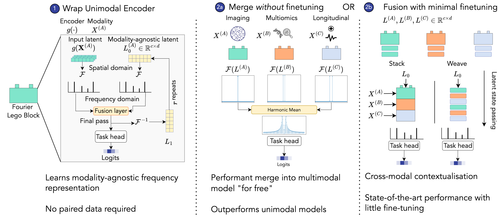

# Multimodal Lego

Code repository for ICLR 2025 paper [**_Multimodal Lego: Model Merging and Fine-Tuning Across Topologies and Modalities_**](https://arxiv.org/abs/2405.19950)


## Efficient multimodal pipelines with little fine-tuning

[[pdf](https://arxiv.org/pdf/2311.09115) | [Installation](#Quickstart) | [Getting Started](./tutorial/01_Getting_Started.ipynb) | [Cite](#Citation)]





## What does MM-Lego provide? 

* ✅ **Performant without end-to-end training**: Lego allows you to combine multiple pre-trained encoders into the same multimodal model with a minimal requirement for paired data for fine-tuning. The encoders can also be combined to a performant multimodal model _without any paired samples_. 
* ✅ **Scalable**: Both LegoMerge and LegoFuse scale linearly with the number of modalities. 
* ✅ **Topology agnostic**: LegoMerge does not require equivalent encoder backbones between the merged models, allowing users to take advantage of the plethora of open-source models for multimodal learning. 
* ✅ **Good with modality imbalance & non-overlapping sets**: Robust in cases of missing modalities and strong modality imbalance. 

## Updates

* **24/04/2025**: Initial camera-ready release (v0.1.0) available! 
* **23/01/2025**: MM-Lego was accepted at ICLR 2025. [Reach out](mailto:konstantin.hemker@cl.cam.ac.uk) to chat in Singapore! 


## Quickstart

### Installation


#### Lightweight dependencies

when you are just looking to use the pytorch models, we provide a lighter weight pip install

```bash
pip install -e .
```


#### Full dependencies

We recommend downloading [mamba](https://github.com/mamba-org/mamba) or micromamba for faster environment management. 

```
mamba env update -f environment.yml
conda activate castle
```

### Pre-commit hooks

We use `black` as a code formatting standard. To use, run: 

```bash
pre-commit install
```


### Git LFS

Some smaller preprocessed files are temporarily stored using large file storage (`git-lfs`). 
```
brew install git-lfs
git lfs install
git lfs pull
```


### Usage

```python
from mm_lego.models import LegoBlock, MILAttentionNet, SNN, LegoMerge, LegoFuse
import torch

# Assume initial encoders for each modality
b = 10 # batch size
# Note - dimensions always denoted as
t_c = 1  # number of channels (1 for tabular) ; note that channels correspond to modality input/features
t_d = 2189  # dimensions of each channel
i_c = 100  # >1 if using MIL setup
i_d = 1024  # dimensions per patch
latent = torch.randn(b, 256, 32)

tab_data = torch.randn(b, t_c, t_d)  # expects (b dims channels)
img_data = torch.randn(b, i_c, i_d)

tab_enc = SNN(t_d, final_head=False)
img_enc = MILAttentionNet(torch.Size((i_c, i_d)), final_head=False, size_arg="tcga")


# Lego Wrapper
tab_block = LegoBlock(in_shape=(t_c, t_d), encoder=tab_enc)
img_block = LegoBlock(in_shape=(i_c, i_d), encoder=img_enc)

# Forward pass of block
print(img_block([img_data], return_embeddings=True))

# merge blocks
merged_model = LegoMerge(blocks=[tab_block, img_block], head_method="slerp", final_head=False)

# forward pass of merged model
merged_model([tab_data, img_data], return_embeddings=True)

# fuse blocks
fusion_model = LegoFuse(blocks=[tab_block, img_block], fuse_method="stack", head_method="slerp", final_head=False)

# Forward pass of fusion model
fusion_model([tab_data, img_data], return_embeddings=True)
```


## Experiments

### Single experiment run

You can run a single experiment configuration using: 

```bash
python mm_lego/main.py --run --config config_dev.yml
```

This will run whatever is currently specified in the `config/config_dev.yml`. Make sure to update the data paths accordingly. 

### Full experiments

To run the full set of experiments, you can run:

```bash
python mm_lego/main.py --plan
```


## Citation

If you find our work useful in your research, please consider citing: 

Hemker, K., Simidjievski, N., Jamnik, M., Multimodal Lego: Model Merging and Fine-Tuning Across Topologies and Modalities in Biomedicine. _The Thirteenth International Conference on Learning Representations (ICLR 2025)_, April 2025.

```
@inproceedings{hemker2024mm-lego,
    author = {Konstantin Hemker and Nikola Simidjievski and Mateja Jamnik },
    title = {Multimodal Lego: Model Merging and Fine-Tuning Across Topologies and Modalities in Biomedicine},
    booktitle = {The Thirteenth International Conference on Learning Representations, {ICLR 2025}},
    year = {2025},

}
```